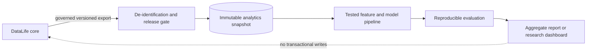

# DataLife Analytics Downstream

> Reproducible, privacy-preserving analytics on de-identified DataLife exports.

[](LICENSE)
[](#project-status)
[](CONTRIBUTING.md)

`datalife-analytics-downstream` is the planned research workspace for statistical
baselines, longitudinal risk-model experiments, public-health surveillance methods,
and exploratory applications that consume governed, de-identified exports from the
[DataLife e-Health](https://github.com/datalife-ehealth) ecosystem.

> [!IMPORTANT]
> This repository currently contains the project contract and community scaffold;
> it does **not** contain validated models or a runnable dashboard. Results are for
> research only, not diagnosis, patient-level care, or public-health operations.

## Project status

**Scaffold / research lead wanted.** No dataset, model, or analytics framework is
endorsed yet. The first implementation should define a versioned, de-identified data
contract and a reproducible baseline before adding complex models or dashboards.

## Scope

### Intended work

- longitudinal feature engineering and transparent statistical baselines;
- epidemiological signal detection on sufficiently aggregated data;
- reproducible notebooks that graduate into tested Python modules;
- model cards, dataset documentation, subgroup evaluation, and calibration checks;
- read-only research dashboards built from publishable synthetic or aggregate data.

### Out of scope

- raw PII, re-identification, linkage attacks, or exporting patient-controlled data;
- patient-level diagnosis, treatment recommendations, or automated interventions;
- mutable writes to the transactional core from analytics jobs;
- production claims without external validation and governance approval; and
- committing datasets, model weights, generated reports, or notebook outputs by
  default.

## Downstream boundary



The analytics layer should consume immutable snapshots, record lineage, and remain
operationally separate from authorization and transactional storage. De-identification
reduces risk; it does not make data automatically anonymous or unrestricted.

## Data contract status

The current
[`datalife-datalake-core`](https://github.com/datalife-ehealth/datalife-datalake-core)
reference API exposes ingestion and per-subject metadata, but it does **not** yet
publish a governed bulk analytics export or partitioned Parquet contract.

Until that contract exists, contributors should use small synthetic fixtures and
document proposed fields, provenance, consent basis, temporal semantics, suppression
rules, and versioning in an RFC. Analytics code must not scrape the transactional API
or assume access to object-storage internals.

## Research quality bar

Every model or surveillance proposal should include:

1. a clearly stated question, population, outcome, and non-use cases;
2. dataset provenance, license, inclusion criteria, and leakage analysis;
3. a simple baseline and a time-appropriate train/validation/test split;
4. discrimination, calibration, uncertainty, and clinically relevant error metrics;
5. subgroup performance and limitations without overclaiming fairness;
6. fixed seeds, locked environments, and commands that reproduce reported results;
7. a model card or equivalent report with intended use and failure modes.

Exploratory notebooks are welcome for review, but reusable logic belongs in tested
modules and notebooks must be cleared of outputs and sensitive metadata before commit.

## Proposed technical direction

- Python 3.11+
- pandas or Polars, PyArrow, scikit-learn, and statsmodels for transparent baselines
- Jupyter for exploration and Streamlit only for non-sensitive research dashboards
- `pytest`, static checks, notebook execution checks, and data-contract validation
- DVC or another manifest-based lineage approach only after the storage RFC

Tools are proposals, not installed dependencies. Select the smallest stack that can
reproduce the study.

## Getting started

Python 3.11 or newer.

```bash
git clone https://github.com/datalife-ehealth/datalife-analytics-downstream.git
cd datalife-analytics-downstream
python -m venv .venv
source .venv/bin/activate          # Windows: .venv\Scripts\activate
pip install -e ".[dev]" -c constraints.txt
pytest
datalife-fixtures generate --seed 42 --subjects 1000 --format parquet --out data/generated
datalife-fixtures validate data/generated
```

The generator and draft v0.1.0 data contract are documented in
[docs/generator.md](docs/generator.md). Generated data stays in the ignored `data/`
folder. Read [CONTRIBUTING.md](CONTRIBUTING.md) before proposing changes to the
contract or adding a baseline.

## Stewardship and contact

| Area | Channel |
|---|---|
| Repository steward and review | [@FinalSunFlower](https://github.com/FinalSunFlower) via GitHub issues or pull requests |
| Analytics research lead | Open — use the organization contribution-task template to propose ownership |
| Core export contract | [`datalife-datalake-core`](https://github.com/datalife-ehealth/datalife-datalake-core/issues) |
| Security or privacy disclosure | Follow [SECURITY.md](SECURITY.md); do not open a public issue |
| General support | See [SUPPORT.md](SUPPORT.md) |

Please follow the organization-wide
[contribution guide](https://github.com/datalife-ehealth/.github/blob/main/CONTRIBUTING.md)
and [Code of Conduct](https://github.com/datalife-ehealth/.github/blob/main/CODE_OF_CONDUCT.md).

## License

Copyright (c) 2026 Luchang Jiang. Released under the [MIT License](LICENSE).
